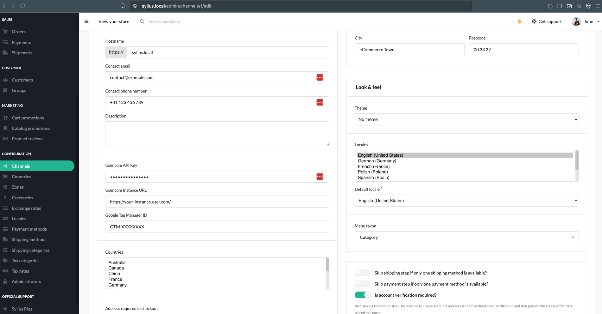

# Installation
1. Add package to your project via composer:
    ```bash
    composer require bitbag/user-com-plugin --no-scripts
    ```
2. Add required environment variables to your `.env` file:
    ```dotenv
        USER_COM_FRONTEND_API_KEY=""
        USER_COM_ENCRYPTION_KEY=your-32-character-long-key
        USER_COM_ENCRYPTION_IV=your-16-character-long-iv
        USER_COM_COOKIE_DOMAIN=""
        MESSENGER_USER_COM_ASYNCHRONOUS_DSN=""
    ```
   - You can find the `USER_COM_FRONTEND_API_KEY` in the User.Com integration guide for `Google Tag Manager (Settings->Setup & Integrations)`. 
   - `USER_COM_COOKIE_DOMAIN` is optional, if not set, cookies will be set for the current domain.


3. Add plugin dependencies to `config/bundles.php` file. Make sure that none of the bundles are duplicated.
    ```php
    return [
        ...
            BitBag\SyliusUserComPlugin\BitBagSyliusUserComPlugin::class => ['all' => true],
            League\FlysystemBundle\FlysystemBundle::class => ['all' => true],
            Sylius\Bundle\GridBundle\SyliusGridBundle::class => ['all' => true],
        ...
    ];
    ```
4. Import required config in your `config/packages/_sylius.yaml` file:
    ```yaml
    imports:
        ...
        - { resource: "@BitBagSyliusUserComPlugin/config/config.yml" }
        ...
    ```

5. Import routes in your `config/routes.yaml` file:
    ```yaml
        bitbag_sylius_user_com_plugin:
            resource: "@BitBagSyliusUserComPlugin/config/routes.yaml"
    ```

6. Extend `Channel` entity `UserComApiAwareTrait` and implement `UserComApiAwareInterface` 
   ```php
    use BitBag\SyliusUserComPlugin\Trait\UserComApiAwareTrait;
    use BitBag\SyliusUserComPlugin\Trait\UserComApiAwareInterface;
   ... 
    class Channel extends BaseChannel implements UserComApiAwareInterface
    {
        use UserComApiAwareTrait;
    }
    ```
    
    >`UserComApiAwareTrait` contains mapping for annotations and for attributes which are required by UserCom integration. If you're using xml mapping, you should add mapping for those properties in your `Channel.orm.xml` file.
   
7. Compile assets
```bash
  yarn install && yarn build
```
8. Add API credentials and GTM to your channel configuration in admin panel. If you decided to extend different object, please make sure that API credentials are set.


9. Configure consumer to run in supervisor:
```bash
   bin/console messenger:consume user_com_asynchronous
```
